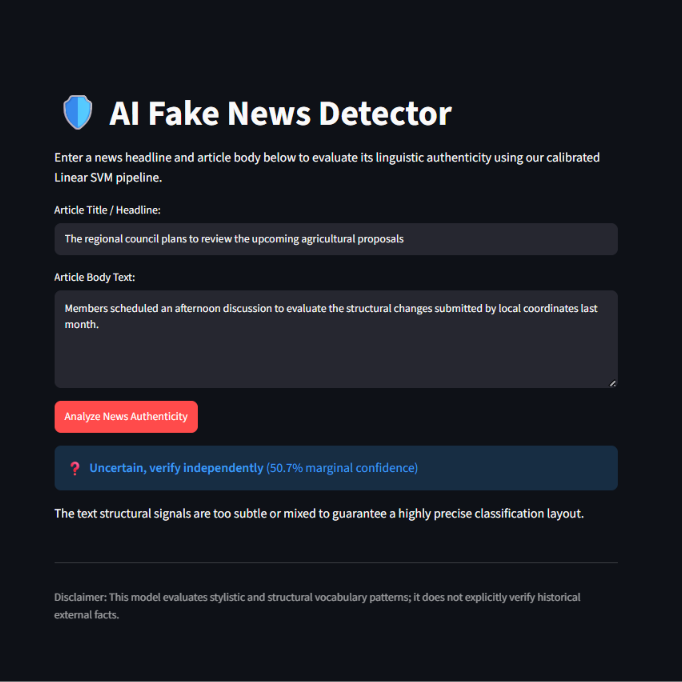

# **AI Fake News Detector**

---

# 🛡️ Building a Leak-Proof AI Fake News Detector 

Most fake news classifiers look great on paper but fail completely in the real world because they accidentally train on "dataset leaks"—like finding corporate wire tags unique to one source. This project implements a leak-proof, end-to-end Machine Learning pipeline and interactive Streamlit web dashboard. 

By training on a diversified corpus and keeping a completely separate dataset hidden for an honest generalization test, this pipeline achieves a **99.34% accuracy score on entirely unseen news origins**.

---

## 📊 Performance & Why I Skipped Transformers

A common trap in NLP is reaching for heavy, slow transformers right away. During my experiments, I benchmarked **Sentence Transformers (all-MiniLM-L6-v2)** and **Latent Semantic Analysis (LSA)**, but a streamlined, transparent approach proved significantly better for this specific vocabulary-driven task:

*   **My Core Pipeline (Sparse TF-IDF + Calibrated Linear SVM):** **96.40%** validation accuracy, scaling up to **99.34%** generalization accuracy on unseen external publishers.
*   **The Transformer Route (MiniLM Embeddings + LogReg):** Dropped down to **82.37%** accuracy while adding heavy computational lag over a CPU runtime.

### 🎯 Enforcing Real-World Safety Floors
*   **Target Precision Control:** Using default probabilities ($0.50$ cutoff) presents an unsafe balance where a real article might be falsely accused. I tuned the decision boundary up to a strict **0.57 threshold** to enforce a **minimum 97% precision constraint** against false alarms.
*   **A Graceful Fallback Layer:** If an incoming article yields a highly ambiguous probability between 43% and 57%, the web application safely defaults to an **"Uncertain, verify independently"** status rather than forcing a blind, risky guess.

---

## 🚀 Live Demo Interface Showcase

### 1. Flagging Clickbait Disinformation
The pipeline successfully leverages negative word weights to flag sensational language frames with absolute certainty:


### 2. Verifying Formal Journalistic Structure
The model isolates semantic layouts and structural phrasing to pass our strict 57% safety boundary cutoff floor:


### 3. Activating the Uncertainty Fallback Banners
When incoming language signals are mixed or too ambiguous to clear precision constraints, the UI declines to force a blind guess:


---

## 🛠️ Critical Engineering Milestones

### 1. Defeating Dataset Leaks with Regex Prefilters
While inspecting the data, I caught a major trap: roughly 99.8% of legitimate news articles in the benchmark data started with an editorial wire marker like `WASHINGTON (Reuters) -`. Leaving those in means the model just learns to look for the word "Reuters" instead of evaluating actual deception. I designed regular expression routines to wipe these markers completely, forcing the model to learn genuine language composition.

### 2. Auditing Dataset Label Inversions
Documentation isn't always accurate. The dataset host stated that `0 = fake, 1 = real`, but an empirical validation check proved the files were distributed entirely backwards. Auditing and mapping this correctly upfront prevented the entire pipeline from learning an inverted logic structure.

### 3. Native Pipeline Encapsulation
To eliminate structural mismatches between training and local execution, I packaged both the text feature vectorizer and the calibrated classifier into a single serialized `Pipeline` object via `joblib`. 

---

## 📂 Project Structure
*   `app.py` - The interactive Streamlit user dashboard layout.
*   `fake_news_pipeline.joblib` - The fully self-contained, pre-trained deployment model artifact.
*   `notebook/` - Holds the complete, executed Google Colab experimental notebook showing evaluation plots, cross-validation checks, and model coefficient interpretations.

---

## 🏃‍♂️ Running the Web App Locally

1. **Clone the project workspace:**
   ```bash
   git clone https://github.com
   cd AI_Fake_News_Detector
   ```

2. **Acquire the Raw Datasets:**
   To replicate or view training, download the original source files from [WELFake on Zenodo](https://zenodo.org) and [ISOT on Kaggle](https://kaggle.com) into a local `data/` folder. *(Note: CSV files are ignored by git via `.gitignore` to maintain clean repository sizing).*

3. **Install Dependencies:**
   ```bash
   pip install -r requirements.txt
   ```

4. **Launch the Application:**
   ```bash
   streamlit run app.py
   ```

---

## Author

**Subrata Kumar Dey**

B.Tech. Computer Science & Engineering (Cyber Security & Privacy)  
DIT University
